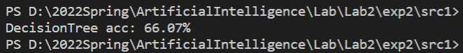
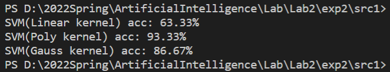
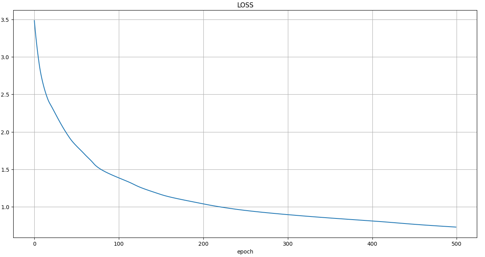
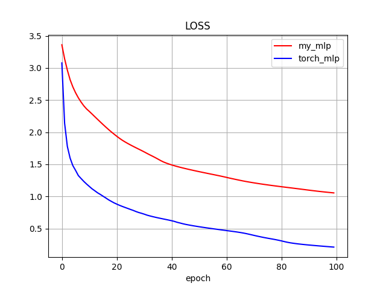
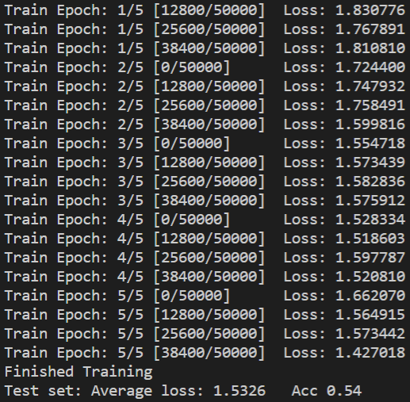

<h1><center>人工智能基础 Lab2 实验报告</center></h1>

<center>By  PB19111690  唐志鹏</center>

## 1 传统机器学习

### 1.1 决策树

#### 1.1.1 决策树分类结果



#### 1.1.2 最优属性

```python
# 目标：信息熵增量最大
# entropy 为信息熵
entropy = self.get_entropy(labels)
# 被选中的属性
selected_attr = 0
# 选中 selected_attr 后的信息熵增量
gain_entropy = 0

# 遍历剩余属性
for attr in attrs:
    # temp_entropy 为选中属性 attr 情况下的信息熵
    temp_entropy = 0
    # 计算 temp_entropy
    for value in values:
        temp_label_list = []
        for feature, label in zip(features, labels):
            if (feature[attr] == value):
                temp_label_list.append(label)
        if len(temp_label_list) != 0:
            temp_entropy += len(temp_label_list) / len(features)
            				* self.get_entropy(temp_label_list)
            
    # 如果选中属性 attr 的信息熵增量大于当前所找到的最优属性的信息熵增量
    # 则，attr 成为新的最优属性
    if (entropy - temp_entropy > gain_entropy):
        gain_entropy = entropy - temp_entropy
        selected_attr = attr
```

#### 1.1.3 生成节点的过程

- **Step1**：如果样本全属于同一类 $C$，则生成 $C$ 类叶结点，结束！
- **Step2**：如果属性集为空，则生成叶节点，类别为样本数最多的类，结束！
- **Step3**：如果所有样本在当前属性集下都相同，则生成叶节点，类别为样本数最多的类，结束！
- **Step4**：生成中间结点 $\text{node}$，选择最优属性 $\text{attribute}$
- **Step5**：对于属性 $\text{attribute}$ 的每一个合法值：重复该过程，生成 $\text{node}$ 的子节点

### 1.2 支持向量机

#### 1.2.1 支持向量机分类结果



#### 1.2.2 训练

```python
# alpha 为 n * 1 的矩阵
alpha = cp.Variable(shape=(n, 1))

# 描述所求的优化问题
objecctive = cp.Maximize(cp.sum(alpha) - (1 / 2) * cp.quad_form(alpha, K))

# 给变量 alpha 添加约束条件
constraints = [alpha >= 0, alpha <= self.C, train_label @ alpha == 0]

# 求解问题
prob = cp.Problem(objecctive, constraints)
prob.solve(solver=cp.ECOS)
```

#### 1.2.3 预测

通过以下公式预测新的数据点：
$$
y^*=sgn\big{(}\sum_{i\in \text{support vector}}\alpha_iy_i\text{KERNEL}(x_i, x^*)+b \big{)}
$$
其中，
$$
b = y_i - \sum_{j \in \text{support vector}}\alpha_j y_j \text{KERNEL}(x_j,x_i)\ \ \ \ \ \ \text{for any i that} \ \alpha_i \neq 0
$$

## 2 深度学习

### 2.1 手写感知机模型

#### 2.1.1 loss训练曲线

训练次数`epochs = 500`



#### 2.1.2 与 pytorch 对比

训练次数`epochs = 100`

**loss 训练曲线**：



**对比最后一次训练的 W4 的梯度**：

```python
# 手写 mlp 的 W4 梯度
[[-8.73776598e-03  8.55069478e-03  8.87927119e-03  8.14593791e-03
   8.67703104e-03 -2.42646422e-04  7.71932102e-03  8.88638443e-03]
 [ 2.73212747e-02 -2.67363399e-02 -2.77637336e-02 -2.54707448e-02
  -2.71313685e-02  7.58707611e-04 -2.41367977e-02 -2.77859753e-02]
 [-2.05079063e-03  2.00688423e-03  2.08400250e-03  1.91188608e-03
   2.03653588e-03 -5.69501415e-05  1.81175729e-03  2.08567201e-03]
 [-1.40078750e-03  1.37079734e-03  1.42347278e-03  1.30590908e-03
   1.39105083e-03 -3.88996541e-05  1.23751636e-03  1.42461313e-03]]

# pytorch 自动求导的 W4 梯度
tensor([[-4.6137e-05,  4.6933e-05,  3.7201e-05, -1.8749e-05, -4.7066e-05,
         -2.4482e-05,  4.5628e-05,  4.3282e-05],
        [ 2.3010e-02, -2.3407e-02, -1.8553e-02,  9.3507e-03,  2.3473e-02,
          1.2210e-02, -2.2756e-02, -2.1586e-02],
        [-1.3483e-02,  1.3715e-02,  1.0871e-02, -5.4791e-03, -1.3754e-02,
         -7.1544e-03,  1.3334e-02,  1.2648e-02],
        [-9.4809e-03,  9.6445e-03,  7.6445e-03, -3.8529e-03, -9.6718e-03,
         -5.0310e-03,  9.3763e-03,  8.8942e-03]], dtype=torch.float64)
```

#### 2.1.2 最终结果

```python
# W1
[[ 1.44154241 -0.70572205 -0.53060594 -1.26182174  1.23238514 -2.13235002
   1.83857695 -0.89543186  0.21702815 -0.29254362]
 [ 1.42385726 -1.81383825 -0.61037474 -0.00264959  1.35358646 -1.31527375
  -0.27951346 -0.64981046 -0.10467731  0.65315762]
 [-0.80975565  1.03428607  0.90770224  0.67602979  0.95491792 -0.92160914
  -0.12839898 -1.16272716 -0.14796985  0.77733689]
 [-0.95720848 -0.50236417 -0.78996248 -0.54940917 -0.53159026  0.09568815
  -1.01849977  0.71346434  1.72412182  0.82384837]
 [-0.22678771 -0.66965284 -0.79378673  1.5057757  -0.31201639 -0.59978141
  -0.06136523  2.22946757 -0.28807449  0.43787653]
 [ 0.041128   -0.21269854 -1.28242442 -0.58283947 -0.38912832  0.57543348
   0.89569124  1.28790591  0.36760612  0.56009524]
 [-0.80315781  1.21851607  0.41068155  0.09627341  0.3502074   0.01672139
   1.01688416  1.90049959  2.42339581 -1.20592968]
 [-1.45074251 -0.63544419  0.5822139   0.87720356  0.46375463 -2.00884169
  -0.29572647  0.80059047 -0.03752291  0.60286157]
 [ 0.14717638 -0.37714199  0.3252729   0.26910263  0.30124466  0.40456962
  -0.40065071  0.25562183  0.56531762  1.41873434]
 [ 1.2044018  -0.02489687 -0.40011638 -0.89844146  0.37555022  0.33949331
  -0.4017186  -0.06338324 -0.51873055  0.19393489]]

# b1
[[-0.70598244]
 [ 1.41669075]
 [ 0.04437926]
 [ 0.28850404]
 [-1.60927306]
 [ 0.18713323]
 [ 0.26314737]
 [-1.14267089]
 [-0.04782131]
 [ 0.43499218]]

# W2
[[ 0.1793618  -0.76758891  1.3998659   1.99373468 -2.1035414   1.12332653
   1.40423534 -0.05496423 -1.25526047  1.31713568]
 [-0.4618635  -0.71932826 -1.24688584  0.77187986  0.70845783 -0.86102885
   0.65442696 -1.15850701  1.10237538 -0.358719  ]
 [ 0.01474454 -0.16917614  0.8223647   1.26630265  0.71756134  0.15866037
   0.06061894  0.78069831  0.40946903  0.35287922]
 [-0.37588375 -2.49316525  1.35281686  2.1311129   0.59398378  0.08055747
  -0.28109178 -0.14396918 -0.23221166 -0.87065632]
 [-0.86818887 -1.31323776  0.08507378 -0.56008994  0.42519435 -0.4259083
   0.86516913  0.17547107  2.15829321 -1.82532925]
 [-0.79728346  1.16186745  2.36590698  0.25184166  0.00367874 -0.18673068
   1.65089219 -0.71105281  0.95822649 -0.56381754]
 [-1.2036897   0.55749237  0.69138899  1.22164595 -0.32255175 -0.70779312
   0.77778531 -0.17431398  0.33941534 -0.05925581]
 [ 1.36996659  0.39406961  2.27809937  1.03979368  0.47543273 -1.84383529
   0.9096589  -0.05587201  0.76186749  1.18312821]]

# b2
[[-0.85677951]
 [ 0.80079937]
 [-0.58629732]
 [ 1.99521004]
 [-1.21442327]
 [-1.63591627]
 [-1.64930437]
 [-0.73798247]]

# W3
[[ 0.43810046 -0.03722468  1.63405369  0.45308581  1.95354312  0.57471806
   1.52475052  0.12040387]
 [-1.60139512  2.43073745 -0.74425337 -0.32796399 -0.61301353 -0.07938587
  -0.21979425 -0.26966044]
 [ 0.71042215  2.14093672  0.50139918 -0.77270361 -0.87196237 -0.63934527
  -1.76459807  1.15193508]
 [-0.5289657  -0.05683709  0.12296874 -1.58270371 -0.65567627  0.94261726
   0.73722099 -0.62103324]
 [ 2.0330596  -1.19668702 -0.18762161 -0.16000852 -2.92163342  2.08127721
   0.45575412 -1.09063805]
 [ 1.83138239  0.74313696  0.17149732 -1.36796999  0.22704755 -1.93383635
   1.32248877 -0.07552035]
 [ 0.82520177  0.91674431  0.84937376  0.15754894  0.80231275 -0.39109829
   0.96182269  1.96195562]
 [ 0.30273524  1.28419623 -1.42469666 -1.46032092 -1.57103487  1.09409358
  -0.33274895  1.45517214]]

# b3
[[-0.65697506]
 [-0.09352057]
 [ 0.53369991]
 [ 0.96113015]
 [-0.0406459 ]
 [-0.01774088]
 [-0.31149165]
 [-0.24708744]]

# W4
[[ 0.16931523  1.45793519 -0.50539116  1.14948378  3.01190782 -1.74418177
  -1.29945161 -1.12566639]
 [-0.36276567  1.12239635 -0.16552993 -0.47382703  0.9383736  -1.46485663
   1.48356141  0.73146966]
 [ 2.24909632 -0.09407556  3.07674527  1.25559392  1.18416089  0.51700759
  -0.61761424 -0.46554385]
 [-0.06611694 -0.71913025  0.40576801 -0.91539571  0.18135043  1.29013582
  -0.28024985  1.89781438]]

# b4
[[0.38480268]
 [1.45158821]
 [0.4767197 ]
 [0.7461332 ]]
```

### 2.2 卷积神经网络

#### 2.2.1 网络结构

```python
self.conv1 = nn.Sequential(
    nn.Conv2d(in_channels=3, out_channels=24, kernel_size=9, padding=4),
    nn.Tanh(),
    nn.AvgPool2d(2)
)	# in: 3 * 32 * 32, out: 24 * 16 * 16

self.conv2 = nn.Sequential(
    nn.Conv2d(in_channels=24, out_channels=32, kernel_size=3, padding=1),
    nn.Tanh(),
    nn.AvgPool2d(2)
)	# in: 24 * 16 * 16, out: 32 * 8 * 8

self.linear1 = nn.Sequential(
    nn.Linear(32 * 8 * 8, 108),
    nn.Tanh()
)	# in: 2048, out: 108

self.linear2 = nn.Sequential(
    nn.Linear(108, 72),
    nn.Tanh()
)	# in: 108, out: 72

self.linear3 = nn.Sequential(
    nn.Linear(72, 10),
    nn.Tanh()
)	# in: 72, out: 10
```

#### 2.2.2 训练与测试结果



训练多次结果，准确率大概在$55\%$左右
